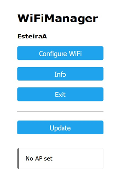
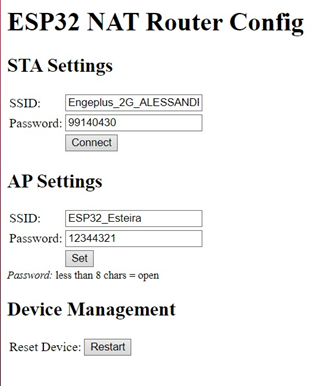

<div align="center">
    
<h1>Máquina de vendas automática portátil</h1>

</div>

<h2>O Problema</h2>

A falta de pontos fixos de venda em eventos que ocorrem em cidades distantes.
Máquinas de vendas convencionais são grandes e pesadas o que dificulta o transporte fazendo com que oportunidades de vendas em eventos  sejam perdidas para isso a nossa solução propõem um projeto de máquina de vendas automática portátil onde que é facilmente carregada de evento em evento trazendo assim uma maior eficiência e maiores oportunidades, abaixo será documentado as etapas e processos para o desenvolvimento do MVP desta solução

## Instalação
- Clone este repositório ```git clone https://github.com/gustavoalvessouza/iot-abp-api.git```
- Instalar pacotes ```pnpm install```
- Rodar aplicação em modo de desenvolvimento ```pnpm start:dev```
- Preencha as variaveis de ambiente no arquivo .env de acordo com o exemplo no arquivo .env.example.
  
<div>
<h2>Diagrama de Arquitetura</h2>

</div>

<h2> Listas de Componentes utilizados </h2>

- 3 ESP32
- 2 Motores de Passo 28byj-48
- 2 Controladores de Motor de passo Driver Uln2003 Arduino Robótica/nf
- 2 Sensores Ultrassonicos Hc-Sr04
- 1 Fonte 5V
  
<div align="center">
<h1>Estrutura</h1>
</div>

<h1>Back-End</h1>

<div>
    <h2>Tecnologias Utilizadas:</h3>
    
#### Node.js, JavaScript e TypeScrip
- O projeto utiliza o ambiente de execução Node.js, que permite a execução de código JavaScript do lado do servidor. O código é desenvolvido principalmente em JavaScript, com o uso opcional de TypeScript para fornecer tipagem estática e outras funcionalidades avançadas.
#### Prisma
- O Prisma é o principal ORM (Object-Relational Mapping) escolhido para a interação com o banco de dados. Ele simplifica a manipulação de dados, oferecendo uma abstração intuitiva para consultas ao banco de dados MongoDB.
#### MongoDB
- O banco de dados escolhido para armazenar os dados do projeto é o MongoDB. Sua natureza de banco de dados NoSQL oferece flexibilidade e escalabilidade, adequando-se bem às necessidades do projeto.

</div>
<div>
    
<h2>Arquitetura</h3>

O projeto adota uma arquitetura limpa, que visa separar as responsabilidades em diferentes camadas para facilitar a manutenção e escalabilidade do sistema. A orientação a objetos é utilizada para promover um design modular e coeso.
</div>
<div>
<h2>Camadas da Arquitetura</h3>
<div><h4>Entidades</h4>
- Nesta camada, são definidas as entidades de negócio do sistema. Cada módulo do projeto possui suas próprias entidades, como máquinas de venda, esteiras, produtos, histórico de vendas e filas de venda.
</div>
<div><h4>Casos de Uso</h4>
- Os casos de uso representam as principais funcionalidades do sistema. Cada módulo possui seus próprios casos de uso, que interagem com as entidades para realizar operações específicas.
</div>
<div><h4>Controladores</h4>
- Os controladores atuam como interfaces entre as rotas da aplicação e os casos de uso correspondentes. Eles recebem as requisições, manipulam os dados necessários e chamam os casos de uso apropriados.
</div>
<div><h4>Gateways</h4>
- Os gateways são responsáveis pela comunicação com fontes externas, como o banco de dados MongoDB. O Prisma é utilizado como gateway para manipular os dados no banco de dados.
</div>
    
## Módulos
 
#### vendingMachines
- Este módulo é responsável por gerenciar as máquinas de venda. As entidades associadas incluem informações sobre as máquinas e funcionalidades relacionadas à venda de produtos.

#### vendingMachinesConveyors
- O módulo vendingMachinesConveyors concentra-se no gerenciamento das esteiras das máquinas de venda.

#### products
- O módulo products gerencia as informações sobre os produtos disponíveis para venda. Isso inclui detalhes como nome, preço e descrição.

#### productSalesHistory
- Este módulo armazena o histórico de vendas dos produtos. Ele registra informações relevantes sobre cada transação realizada.

#### shoppings
- O módulo shoppings é responsável por armazenar a fila de vendas. Ele gerencia a ordem em que as transações são processadas, garantindo uma experiência de compra eficiente.


## Documentação Postman

A documentação das APIs está disponível no Postman para facilitar o teste e entendimento das funcionalidades. Você pode acessar a coleção Postman <a class="sc-fznMAR bdDlXZ markdown-link" href="https://documenter.getpostman.com/view/19858191/2s9YXiYLxg" target="_blank" rel="noreferrer noopener nofollow"><span>aqui</span></a>
<div>
    
# API De Pagamento
## Mercado Pago

### Etapas
- 1ª A parte de pagamentos foi feita por meio de um API do mercado pago, aonde que foi criado uma conta da plataforma de developers do mercado pago para ter acesso a um acces token
- 2ª Tendo o token de acesso foi criado um endpoint para a API que faz uma requisição do tipo POST para o endpoint do mercado /payaments passando todas as informações sendo elas, valor do pix, dados do comprador, endereço e access token
- 3ª A API do mercado pago retorna um JSON contendo o QR CODE para o pagamento ser efetuado via pix
- 4ª Para consultar o status do pagamento utilizamos o endpoint /payments, porém consultando via GET para ter a resposta se o pagamento foi efetuado com sucesso e prosseguir para próxima etapa.
</div>

# Front-End

CAde meu resumo


# Funcionamento Do Embarcado

### Dois ESP32 das Esteiras
#### Funcionamento das funções
- Inclui as bibliotecas
- Define os pinos
- Inicia os pinos de entrada e saída.
- Inicia o wifi com auxílio do wifi maneger, que cria uma rede do esp para conectarmos com o celular e configurar em qual rede wifi ele deve conectar.
- Inicia a task que fica consultando o backend se temos uma venda, assim que temos uma venda ele chama a função de ligar a esteira.
- Função de ligar a esteira que gira o motor e inicia a leitura do sensor
- Leitura do sensor, fica lendo o sensor e quando temos uma distância menor que 7cm (passa um item) ele desliga.

### ESP32 da Central
#### Funcionamento das funções
- Inicia uma rede WIFI para os ESP32 das Esteiras se conectarem a uma rede Wifi para poderem compratilhar a internet
- Utiliza da biblioteca Wifimaneger para conectar as esteiras ao wifi



# Time

<table>
  <tbody>
    <tr>
      <td align="center" valign="top" width="14.28%"><a href="https://www.instagram.com/alaerciomjunior/"><br /><sub><b>Alaercio Marques</b></sub></a><br />
      <td align="center" valign="top" width="14.28%"><a href="https://github.com/BeloneDF"><br /><sub><b>Belone Zorzeto</b></sub></a><br />
      <td align="center" valign="top" width="14.28%"><a href="https://github.com/carlospasqualidev"><br /><sub><b>Carlos Pasquali</b></sub></a><br />
      <td align="center" valign="top" width="14.28%"><a href="https://www.linkedin.com/in/daniel-lima-milak-07284519a/"><br /><sub><b>Daniel Milak</b></sub></a><br /></a></td>
      <td align="center" valign="top" width="14.28%"><a href="https://github.com/gustavoalvessouza"><br /><sub><b>Gustavo Alves</b></sub></a><br /></td>
      <td align="center" valign="top" width="14.28%"><a href="https://github.com/VPente"><br /><sub><b>Vítor Penteado</b></sub></a><br /></td>
    </tr>
   
   
